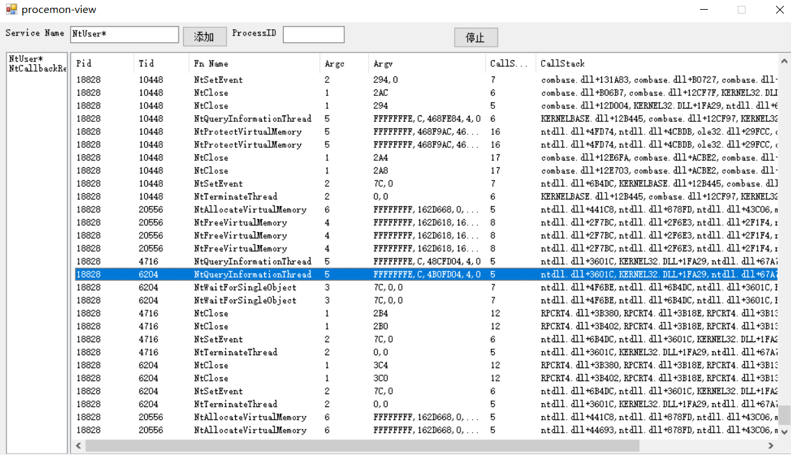

## 什么是 Wow64

Wow64 是让 64 位的 Windows 可以运行 Win32 程序的兼容层

在操作系统安装目录中 `Windows/SysWOW64 ` 就是 32 位程序的 runtime（运行时）库，`Windows/System32 ` 则是 64 位程序 runtime 库，在运行 Win32 程序时 `Windows/System32 ` 目录会被重定向到 `Windows/SysWOW64 ` 目录。


## Wow64 是怎么调用系统 API 的呢
Wow64

``` 
77962C00 | B8 25000000              | mov eax,25                              | 25:'%'
77962C05 | BA 50889777              | mov edx,ntdll.77978850                  |
77962C0A | FFD2                     | call edx                                |
77962C0C | C2 1400                  | ret 14                                  |
```

打开一个 Win32 程序，在 ntdll.dll 中可以看到是通过调用 edx 进行系统调用的，Win7 64 位应该是 `call dword ptr fs:[0xC0]` ，但是没关系他们都指向一个地方（是的没错，Wow 64 Gate 就保存在 `fs:[0xC0]` 中

```
7797884F | CC                       | int3                                    |
77978850 | FF25 2892A177            | jmp dword ptr ds:[<Wow64Transition>]    |
77978856 | CC                       | int3                                    |
```

可以看出字面意思 `Wow64Transition`

```
778E7000 | EA 09708E77 3300         | jmp far 33:778E7009                     |
```

这条指令将 cs 段选择器设置为 0x33，从 32 位切换到 64 位模式，并跳转

进入 Wow64 进行 API 翻译，之后通过调用指令进入内核，完成 API 调用

## Wow64 Heaven's Gate(天堂之门) Hook

现在我们知道 Wow64 Gate 地址保存在 `fs:[0xC0]` 中 ，在 TEB 结构中是 `WOW32Reserved ` 成员

完成后



## 资料

[WoW64 WiKi](https://en.wikipedia.org/wiki/WoW64)

[Knockin’ on Heaven’s Gate – Dynamic Processor Mode Switching](http://rce.co/knockin-on-heavens-gate-dynamic-processor-mode-switching/)


[WOW64!Hooks: WOW64 Subsystem Internals and Hooking Techniques](https://www.fireeye.com/blog/threat-research/2020/11/wow64-subsystem-internals-and-hooking-techniques.html)

[线程信息块](https://zh.wikipedia.org/zh-hans/%E7%BA%BF%E7%A8%8B%E4%BF%A1%E6%81%AF%E5%9D%97)